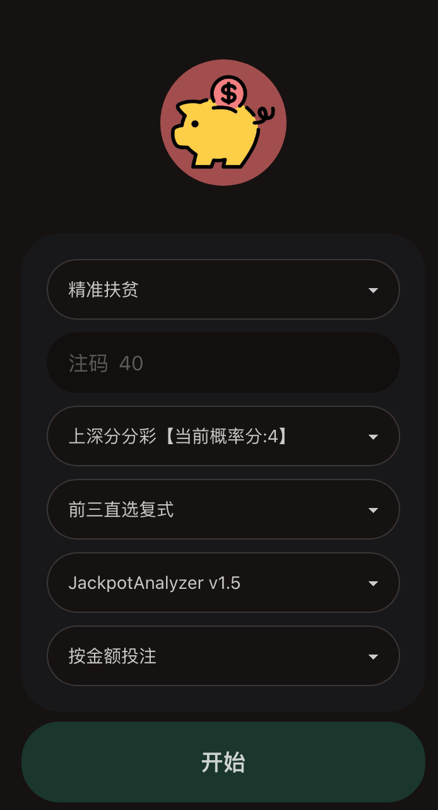
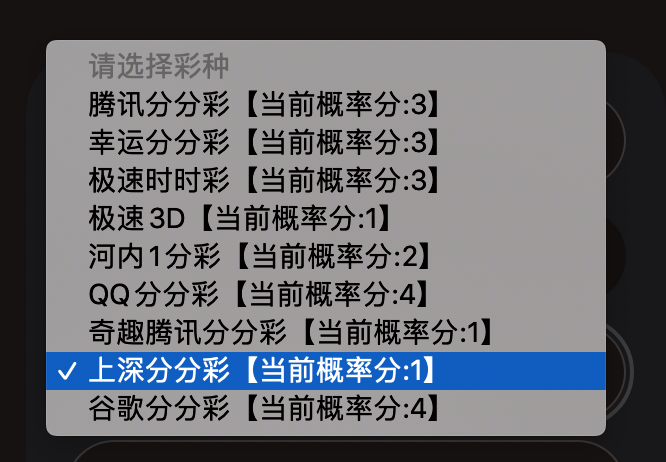
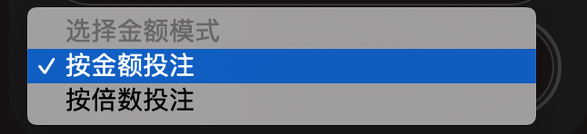
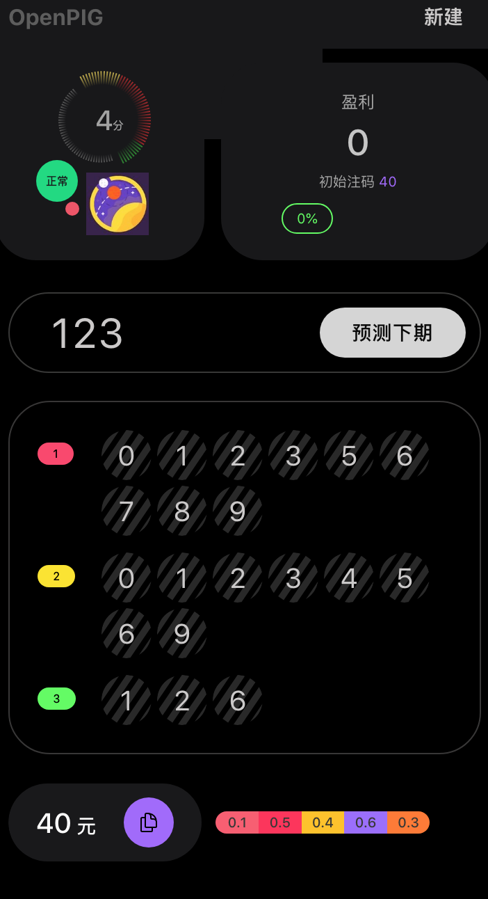
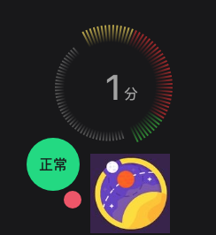
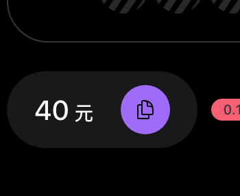
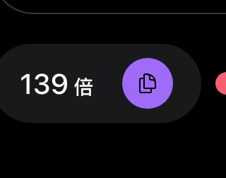

  
> 软件支持几乎所有平台，可以在任意平台投注。我们不是盘口代理，不是倍投套路。

## 1. 配置界面

  

输入序列号并验证成功后，你将看到配置界面。

### 模式

不同的模式决定了预测和配注时的算法。

下表中，每轮盈利是指每一轮的平均盈利范围。

> 一轮由多期组成，可能十几期到几十期。当算法认为未来几期胜率太低时，就会停止预测避免风险，这就完成了一轮

安全本金是建议的最小本金仓位，由于可能遇到多期连输的现象，如果本金太少会导致无法继续投注，前面几期就白打了。

  
| 模式 | 初始投注额 | 每轮盈利 | 建议安全本金 | 说明 |

| ---- | :----- | ---------- | ------ | --------------------------- |

| 精准扶贫 | 30元 | 300-800元 | 1500元 | |

| 共同富裕 | 30元 | 500-1100元 | 3000元 | |

| 一带一路 | 100元 | 1300-2200元 | 7000元 |  |

| 通商宽衣 | 80元 | 3600-7000元 | 20000元 | |

| 中非合作 | 100元 | 8500-16000元 | 50,000元 | |

  

### 注码

  
注码根据本金何投注模式以及预测模型自动计算得出，是投注开始后最初的投注额，** 在投注过程中，注码大小会根据下一注可能中奖的概率进行调整。**

  

  

### 彩种选择

  
顾名思义，想打哪个选哪个。值得注意的是，彩票名称后面的分值是指未来二十局盈利及输赢状况的评分，理论上分越高盈利越高，风险越低。建议打最高分的。

（合作后，可以免费定制其他彩种，我们需要半个月左右的时间进行训练。但不是所有彩种都能定制。）

  

### 模型选择

所有模型都是神经网络训练得出的，如果某一模型的效果下降，我们会自动下架。对这些模型的理解需要一定的专业能力，建议默认或者随缘。平均效果符合宣传效果。

  

  ### 金额模式

- 按金额投注（推荐）：投注时，在你的平台投注界面输入本软件给出的投注金额。但不是所有平台都支持这种模式。
- 按倍数投注：如果不支持金额投注，就选择按倍数投注。在平台倍数区域选择“1厘”。然后输入本软件提供的倍数。这种方式是采用倍数的方式尽量凑出投注金额，会有误差。
  
  

## 2. 预测界面

  

### 盈利

  
根据1:990的赔率计算出的当前盈利，由于不同平台的小数点精确度不同，这里的盈利可能与你实际的盈利有非常细小的误差。

  
  
### 状态区

  

状态区展示了当前彩票的当前概率分值，软件状态。

  
上图中的“1分”是一个评分，评分越高，就说算法认为未来20期内盈利的可能越高。
如果预测过程中概率分值降低，并且此时你处在盈利状态，可以考虑及时止赢。如果还没盈利，只要软件没弹窗提醒，就可以继续打。

软件状态只要显示为“正常”，就证明它可以正常工作。

  

### 开奖号码输入

输入当前期的开奖号码。

软件本身是自动抓取开奖期号和开奖号码的。但由于可能的延迟问题，还是需要手动输入确认一下，这样可以避免因为延迟导致的预测后投注时间不够的问题。

如果预测的是前三直选复式，开奖号码只需要输入前三位即可。

输入后点击那个白花花的按钮，就会返回下局预测结果和投注金额(或倍数)

> 注意：开始预测后，必须在一轮中连续预测，不能中断，如果遗忘或输错了某一期的号码，会导致后面的预测全部失败。  

  

### 预测号码区

  

对于前三直选复式而言，号码区的第一组就是预测出来下局第一位的复式号码，以此类推。按号码在你的投注平台选择即可。

  

  

### 投注金额

  

投注金额（或倍数）的数值是下局你应该投注的金额，点击上面的预测按钮后会自动复制到剪切板，去投注平台粘贴即可。比如显示的是50，那么就在投注平台输入50元。

  

如果你在设置界面选择的是按倍数投注，那么就会显示应该投注的倍数

> 前面说过了，倍数是“1厘”的倍数。

  
  

### 彩虹条

  

彩虹里数数值是未来五局的命中概率，不需要去理解它。

  

### 3. 预测结束提醒

  

如果未来N局（N由算法自动决定）的可能命中率过低，就会弹窗提醒，这时就不要投注了，否则会亏损。此时一轮的预测就完成了。此时的盈利额就是你本轮获得的利润。
  

