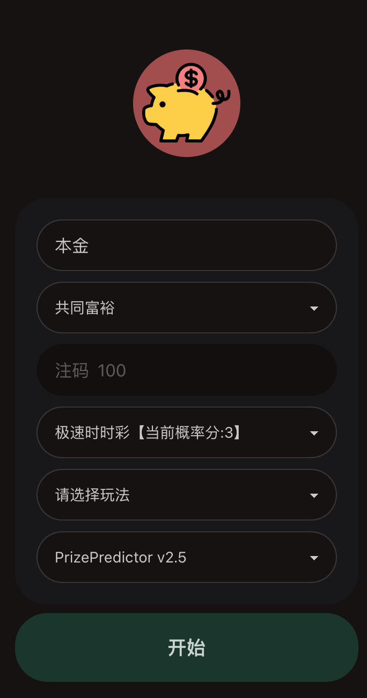
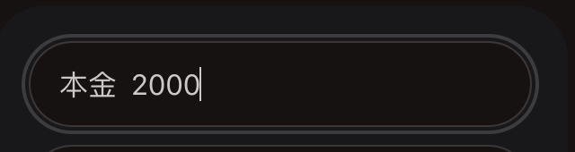
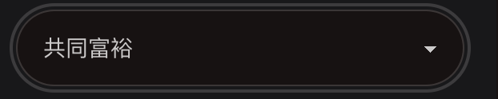
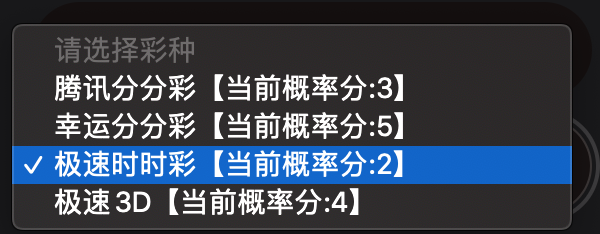
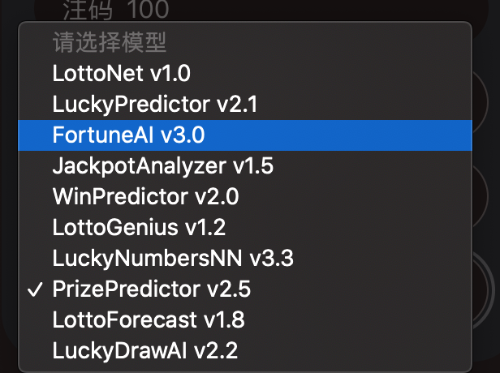
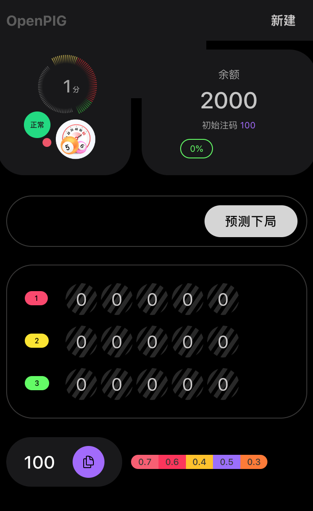
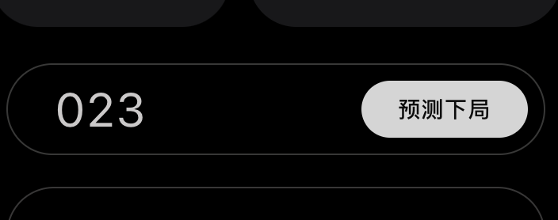
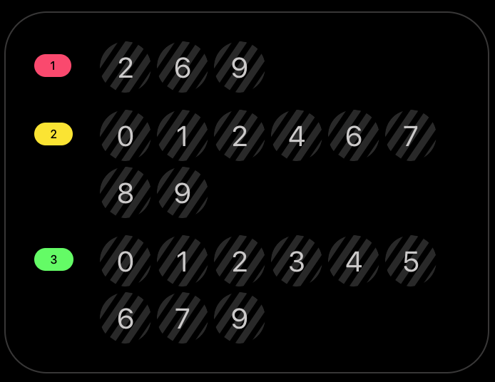
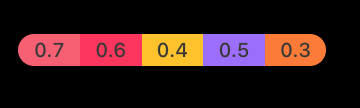

## 1. 配置界面

输入序列号并验证成功后，你将看到配置界面。

### 本金

本金是一轮预测的成本，建议不能低于2000，过少的本金会由于配注时小数点的原因导致不精确。
本金需输入整数。

### 模式

不同的模式决定了预测和配注时的算法。模式分为共同富裕和精准扶贫。

#### 共同富裕

盈利高且通常较快达到目标，初始投注金额为100，预测过程中投注金额范围在 20 - 300之间，遭遇连输时也可能提高值500左右。适合大气的朋友，也就是不至于注码稍微大点都舍不得投的。

#### 精准扶贫

如果开始还没有建立信心，可以使用这个模式。 盈利较低且耗时略长，平均投注额一般都在几十块，但也有一定概率增加到几百。

### 注码

注码根据本金何投注模式以及预测模型自动计算得出，是投注开始后最初的投注额，注码大小会根据下一注可能中奖的概率进行调整。

### 彩种选择

顾名思义，想打哪个选哪个。值得注意的是，彩票名称后面的分值是指未来二十局盈利及输赢状况的评分，理论上分越高盈利越高，风险越低。建议打最高分的。

### 模型选择

所有模型都是神经网络训练得出的，如果某一模型的效果下降，我们会自动下架。对这些模型的理解需要一定的专业能力，建议默认或者随缘。平均效果符合宣传效果。

## 2. 预测界面

###  余额

根据990的赔率计算出的余额，由于不同平台的小数点精确度不同，这里的余额可能与与你实际的盈利有非常细小的误差。

### 状态区

状态区展示了当前彩票的当前概率分值，软件状态。

如果预测过程中概率分值降低，只要软件没弹窗提醒，就可以继续打。

软件状态只要显示为正常，就证明它可以正常工作。

### 开奖号码输入

软件本身是自动抓取开奖期号和开奖号码的。但由于可能的延迟问题，还是需要手动输入确认一下，这样可以避免因为延迟导致的预测后投注时间不够的问题。

如果预测的是前三直选复式，开奖号码只需要输入前三位即可。

输入后点击那个白花花的按钮，就会返回下局预测结果。

### 预测号码区

对于前三直选复式而言，号码区的第一组就是预测出来下局第一位的复式号码，以此类推。按号码在你的投注平台选择即可。

### 投注金额

投注金额的数值是下局你应该投注的金额，点击上面的预测按钮后会自动复制到剪切板，去投注平台粘贴即可。比如显示的是50，那么就在投注平台选择50元。

> 如果你的平台不支持按金额投注，那么就无法使用本软件了，因为按倍数调整金额会错过投注时间。没有办法的事。

### 彩虹条

彩虹里数数值是未来五局的命中概率，不需要去理解它。

### 3. 预测结束提醒

如果未来N局（N由算法决定）的可能命中率过低，就会弹窗提醒，这时就不要投注了，一轮的预测就完成了。

